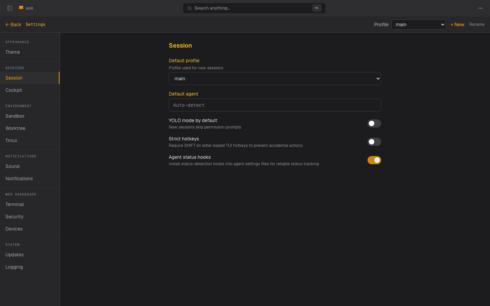

# Settings & Profiles

The settings view mirrors the TUI settings layout so muscle memory
carries over. It is grouped into tabs you can edit per profile or
globally. This page maps the tabs and covers the web-only pieces:
the conversation font size, the profile picker, connected-device
tracking, and step-up elevation.
For running the server, see the [Web Dashboard overview](../web-dashboard.md).

## Tab groups

Settings are organized into the same groups as the TUI:

- **Appearance**: Theme.
- **Sessions**: Session defaults and Structured view (the replay and watchdog
  tuning knobs; see [Structured View Internals](../../development/internals/structured-view.md#global-tuning-acp)).
- **Environment**: Sandbox, Worktree, and Tmux.
- **Notifications**: Sound and Notifications (web push; see
  [Push notifications](../../push-notifications.md)).
- **Web Dashboard**: Terminal, Security, and Connected Devices.
- **System**: Updates and Logging.

Every config field that exists in the TUI settings is editable here too: the
panel is generated from the same settings schema as the TUI, so a field
declared once appears on both surfaces and they never drift. The only host-side
knob the dashboard does not surface is the host environment list, which stays
TUI/`config.toml`-only.

## Conversation font size

**Sessions > Structured view > Conversation display** sets the base font size
of the structured-view conversation transcript, separately for mobile and
desktop. Prose, headings, lists, tables, and fenced code all scale from that
base, so shrinking it fits more of a transcript on a phone screen.

The mobile value applies when the device has a coarse primary pointer (touch)
*and* the viewport is narrower than 768px, the same rule the rest of the
dashboard uses to decide what counts as mobile. A touch laptop and a narrowed
desktop window both keep the desktop value. The switch happens live, so
resizing the window or rotating a phone reflows the transcript without a
reload.

Each axis runs from 6px to 28px in 1px steps and defaults to 14px, the same
range as the terminal font sizes under **Web Dashboard > Terminal**, so the two
sliders read alike. Drag the slider or pick the exact size from the px dropdown
next to it; the two stay in sync.

The number you pick is relative to your browser's own font-size setting rather
than an absolute pixel size: the 14px default renders at 14px with the usual
16px browser default, and at 17.5px if you have raised your browser's base font
size to 20px. Every size scales by that same factor, so the setting stacks with
browser-level zoom or accessibility preferences instead of overriding them.

Both values are dashboard preferences rather than agent config: they live in
the `aoe-web-settings` browser storage entry, which the dashboard mirrors to
the daemon's web-UI state, so they follow you to your other browsers and
devices the same way the terminal font sizes do. They are stored separately
from the terminal font sizes and are not part of the agent config schema, so
they are not per profile and do not appear in `config.toml`.

## Profiles

The profile picker switches the active profile and scopes which
settings you are editing. Each profile carries its own session defaults,
sandbox / worktree config, and overrides; global settings apply when a
profile does not override a field. Creating, renaming, deleting, or
changing the default profile is a gated action (see Step-up elevation
below).

## Connected devices

Under **Web Dashboard > Connected Devices**, the dashboard lists every
signed-in login session as a device, with a browser and OS label parsed
from the user agent, the origin IP, and a relative "last seen" time. The
session you are using is labeled "this device". The list polls every ten
seconds and refreshes when you return to the tab, so a device that just
signed in (or went quiet) shows up without a manual reload. This is the
surface for spotting an unexpected session.

Each other device has a **Revoke** button that ends just that session,
and **Sign out all devices** signs every device out at once (including
this one). Both are step-up actions: the first click after a fresh page
load surfaces the passphrase prompt (see Step-up elevation below).

Sessions are persisted to an owner-only file under the app dir, so they
survive an `aoe serve` restart: signed-in devices stay signed in across
a daemon bounce (config edit, `aoe update`, crash) instead of being
re-prompted for the passphrase. Changing the passphrase drops every
persisted session. To opt out and force re-authentication on every
restart, turn off **Persist login sessions** under Web Dashboard, or set
`auth.persist_sessions = false` in `config.toml`.

## Step-up elevation

When passphrase login is configured, day-to-day actions (sending prompts, resolving approvals, switching mode) never re-prompt. Editing persisted config is different: saving the global settings panel, creating / deleting / renaming a profile, editing a profile, or changing the default profile requires that your login session was elevated within the last 15 minutes via `POST /api/login/elevate`. The first such action after a page load surfaces an inline passphrase prompt; subsequent edits inside the window go through without re-prompting.

This narrow gate covers the persisted-tamper attack (a stolen session planting a malicious Docker image, worktree template, or profile) without friction on the conversation surface.

Browsers on the same host as the daemon (localhost) never see the prompt: a same-host caller already passes the filesystem trust boundary and could run the equivalent CLI command with no passphrase, so the gate only applies to remote callers.
