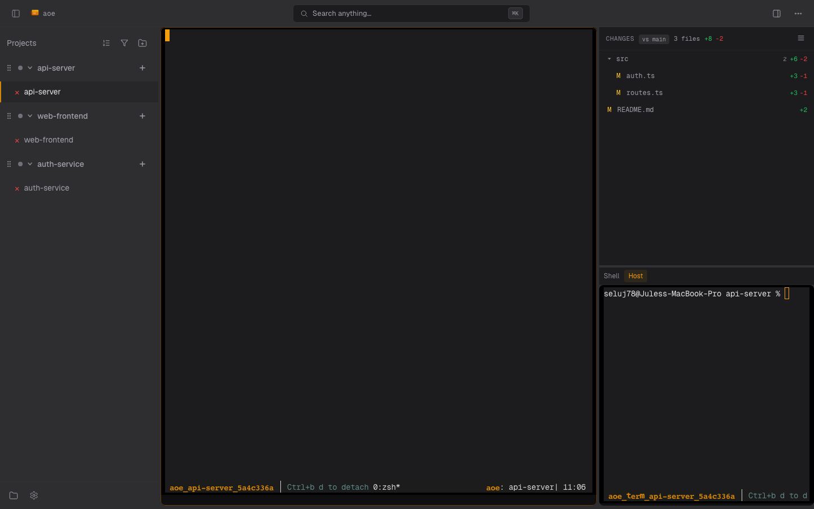

# Terminal View

For tmux-backed sessions the dashboard renders the agent's pane as a live terminal in the page, plus an optional paired shell. This page covers both terminals, how they are streamed, reconnect behavior, and the close codes you may see when a connection fails. For the structured-view rendering used by ACP sessions, see the [Structured view overview](../../structured-view.md).

## Agent terminal

The agent pane is streamed the same way on desktop and on a phone. The server renders the pane and pushes its rows over a WebSocket; the dashboard draws them as real text, so scrolling, selection and zoom are the browser's own. There is no xterm.js and no PTY attach.

Where it can, the server renders from the [VT live transport](../live-mode.md#the-vt-live-transport): the pane's output streams through `tmux pipe-pane` into an in-process terminal grid, a frame is published the moment the grid changes, and keystrokes travel back over the same socket. Full-screen agents that bracket each repaint in synchronized output (Claude Code's fullscreen renderer, for example) are published only between brackets, so the page never paints a half-drawn screen. Only rows that changed are sent after the first frame. When the transport is unavailable (tmux older than 3.4, `[tmux] vt_live = false`, a split window, or a pane whose grid could not be seeded), the server falls back to `tmux capture-pane` snapshots on a 50 ms cadence and delivers input with `tmux send-keys`. The fallback cannot withhold a half-drawn repaint. Add `?livedebug=1` to the URL to see which transport a session is using.

Scrolling up into history widens the window the server sends and surfaces a **Back to live** button; scrolling back to the bottom (or clicking it) returns to the live tail. The agent keeps running while you read.

## Copy and scroll

The terminal uses tmux for scrollback and selection, so copy and scroll work with no modifier keys:

- **Scroll** with the mouse wheel (or a one-finger swipe on touch) through tmux scrollback. Touch scrolling follows the finger like any native list: drag down to look back through history, drag up to head back toward the live tail.
- **Select** by click-dragging across the text. Dragging upward past the top edge scrolls into scrollback and extends the selection. Releasing the drag copies to your system clipboard automatically; no Ctrl/Cmd+C needed.

Mouse-enabled full-screen agents copy through OSC 52 instead: AoE forwards the agent's clipboard event through the live connection to the same browser clipboard path.

Copy relies on the browser Clipboard API, which only works in a secure context: HTTPS (the remote-access tunnel modes) or `http://localhost`. On a plain-HTTP LAN/VPN origin the browser blocks clipboard writes, so the selection stays visible but is not copied. Firefox is best-effort (it lacks the async clipboard write); Chromium and Safari copy reliably.

## Paired terminal

Each session can open a **paired terminal**: a host (or, for sandboxed sessions, in-container) shell rooted at the session's working directory. On desktop it shares the split with the agent terminal; on mobile it is one of the right-panel picker's views. It stays alive in the background when you switch away, preserving scrollback and focus.

For sandboxed sessions, the **Container** tab launches the container user's preferred shell, resolved inside the container (passwd entry, then `$SHELL`, then bash, sh). Candidates must be regular executable files and either have a recognized shell name or be listed exactly in `/etc/shells`. Known-compatible shells run in login mode; other authorized shells run plain. Minimal images without `getent` read `/etc/passwd` directly.

## Reconnect

If the WebSocket drops (network blip, tunnel re-auth, daemon restart), the terminal reconnects on a fast-start retry ladder (200ms, 400ms, 800ms, 1.5s, 3s, 6s, 10s) so transient warm-up failures recover in well under five seconds. A disconnect banner shows the current state; a permanently dead pane surfaces a manual retry button instead of looping.

### Terminal WebSocket close codes

When the browser fails to reach a working terminal, the disconnect banner shows the close code returned by the server:

| Code | Reason string     | Meaning                                                                                   | Client behavior            |
| ---- | ----------------- | ----------------------------------------------------------------------------------------- | -------------------------- |
| 1001 | `server shutdown` | Daemon is shutting down (SIGINT/SIGTERM).                                                 | Retry with normal backoff. |
| 1013 | `tmux_not_ready`  | Pane did not become capturable within 2s. Usually a benign warm-up on first session open. | Retry with normal backoff. |
| 4001 | `pty_dead`        | The live view was running but the pane permanently exited.                                | Show "Click retry" banner. |

## Read-only mode

When the server runs with `aoe serve --read-only`, the terminal renders the live stream but drops keystrokes: you can watch sessions but not type into them. The session-row Delete and triage actions are hidden too.

## On mobile

The phone renders the same live view, tuned for touch:

- **Scrolling is the browser's own scroll**: momentum, rubber-banding, and finger-true tracking, over the pane's real scrollback. For a full-screen agent, whose scrollback lives inside the app, a drag is forwarded to the app as wheel input instead, one line at a time and paced to the app's redraws.
- **Text selection is native**: long-press to select and copy, like any web page.
- **Typing** goes back over the same WebSocket; tapping anywhere on the terminal brings up the soft keyboard, the floating keyboard button toggles it open and closed, and the terminal toolbar provides arrows, Tab, Esc, a `Ctrl` modifier toggle, interrupt, and paste. Opening the keyboard never resizes the agent's pane.
- **Pinch** adjusts the font size; the pane is resized to the resulting grid once, when the gesture ends.

A "Back to live" pill appears while you are scrolled up; tapping it (or scrolling to the bottom) returns to the live tail. The pane stays mounted while you switch views so the connection and scroll position survive.

Add `?livedebug=1` to the dashboard URL to overlay frame rate, arrival-to-paint latency, and the share of updates that arrived as row patches.
